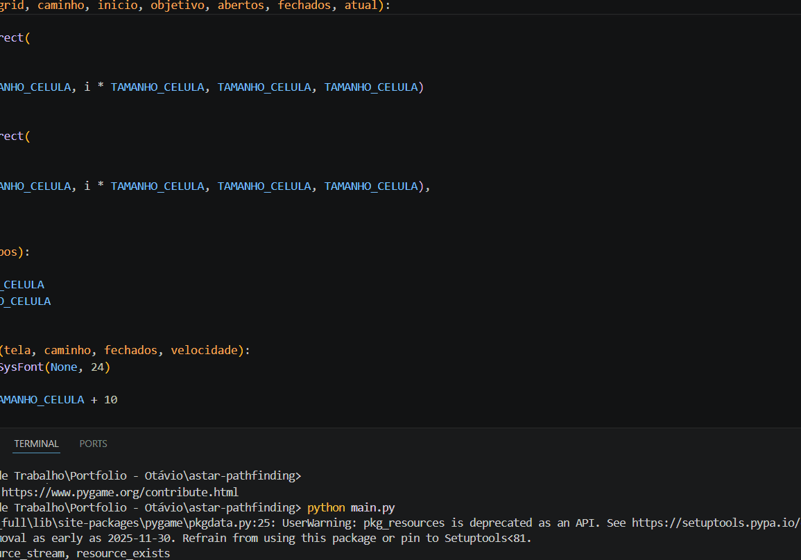

# 🧠 A* Pathfinding Visualizer

Visualização interativa do algoritmo A* utilizando Python e Pygame.

## 🎥 Demonstração



## 🚀 Funcionalidades

- Visualização passo a passo do algoritmo A*
- Criação de obstáculos com o mouse
- Definição de ponto inicial e objetivo
- Animação dos nós abertos e fechados
- Destaque do nó atual
- Controle de velocidade da execução
- Painel com métricas:
  - Tamanho do caminho
  - Nós explorados
  - Custo total

## 🎮 Controles

- `S + clique` → definir início
- `G + clique` → definir objetivo
- `Clique` → adicionar/remover obstáculo
- `SPACE` → executar algoritmo
- `R` → resetar grid
- `↑ ↓` → controlar velocidade

## 🛠 Tecnologias

- Python
- Pygame

## ▶️ Como executar

```bash
pip install -r requirements.txt
python main.py